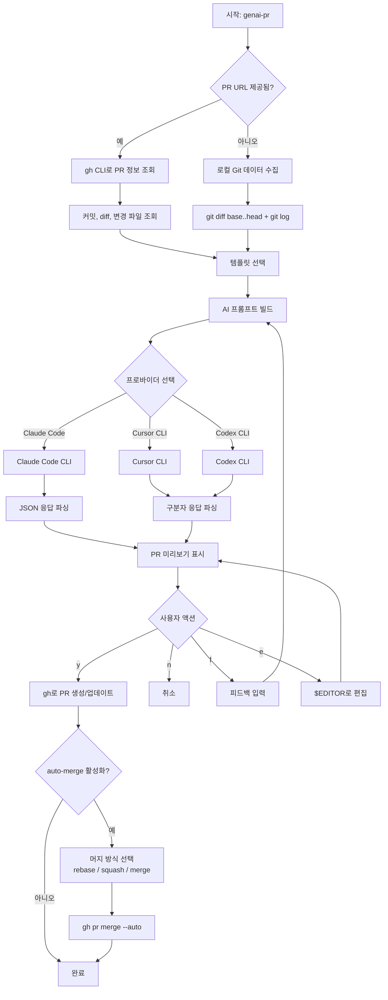

# genai-pr

Claude Code, Cursor CLI, Codex CLI를 활용한 AI 기반 PR 설명 생성 도구.

[](https://www.npmjs.com/package/genai-pr)
[](https://opensource.org/licenses/MIT)
[](https://github.com/Seungwoo321/genai-pr)

> 다른 언어로 보기: [English](./README.md)

## 주요 기능

- **AI 기반 PR 설명 생성** - Claude Code, Cursor CLI, Codex CLI를 사용해 PR 제목과 본문 생성
- **템플릿 기반** - 내장 템플릿(feature, bugfix) + 사용자 정의 프로젝트 템플릿 지원
- **기존 PR 지원** - `--url` 옵션으로 이미 생성된 PR의 설명을 재생성
- **다국어 지원** - 영어 또는 한국어로 제목과 본문 생성
- **인터랙티브 워크플로우** - PR 생성 전에 검토, 피드백, 에디터 편집, 재생성 가능
- **GitHub CLI 연동** - `gh pr create`를 통해 직접 PR 생성
- **자동 머지 설정** - PR 생성 후 선택적으로 auto-merge 활성화, 머지 방식(rebase / squash / merge) 선택 가능

## 동작 방식



## 사전 요구사항

다음 AI CLI 도구 중 최소 하나가 설치되어 있어야 합니다:

- [Claude Code CLI](https://docs.anthropic.com/en/docs/claude-code) - Anthropic 공식 CLI (명령어: `claude`)
- [Cursor Agent CLI](https://www.cursor.com/) - Cursor 에이전트 CLI (명령어: `agent`)
- [OpenAI Codex CLI](https://github.com/openai/codex) - OpenAI Codex CLI (명령어: `codex`)

추가로 [GitHub CLI](https://cli.github.com/) (`gh`)가 설치되어 있고 인증이 완료되어 있어야 합니다.

## 프로바이더

각 프로바이더는 정식 이름 또는 단축 별칭으로 사용할 수 있습니다:

| 정식 이름 | 단축 별칭 | 실제 CLI |
|-----------|-----------|----------|
| `claude-code` | `claude` | `claude` |
| `cursor-cli` | `cursor` | `agent` |
| `codex-cli` | `codex` | `codex` |

## 설치

```bash
# 전역 설치
npm install -g genai-pr

# 또는 npx로 즉시 실행 (설치 불필요)
npx genai-pr claude
```

## 사용법

### PR 설명 생성

```bash
# 정식 이름 사용
genai-pr claude-code
genai-pr cursor-cli
genai-pr codex-cli

# 단축 별칭 사용 (동일하게 동작)
genai-pr claude
genai-pr cursor
genai-pr codex

# 옵션과 함께 한 줄로 실행
genai-pr claude -t feature -b main

# head, base 브랜치 지정
genai-pr claude --branch feature/AUTH-123 --base develop

# 드래프트 PR로 생성
genai-pr claude --draft

# PR 생성 없이 미리보기만 실행
genai-pr claude --dry-run

# 특정 모델 지정
genai-pr claude --model sonnet
genai-pr cursor --model claude-4.5-sonnet
genai-pr codex --model gpt-5.4
```

### 기존 PR 설명 재생성

```bash
# 이미 생성된 PR의 제목과 본문을 갱신
genai-pr claude --url https://github.com/owner/repo/pull/15
```

### 인증

```bash
# 로그인
genai-pr login claude
genai-pr login cursor
genai-pr login codex

# 상태 확인
genai-pr status claude
genai-pr status cursor
genai-pr status codex
```

### 지원 모델 목록 확인

```bash
genai-pr models claude
genai-pr models cursor
genai-pr models codex
```

### 사용 가능한 템플릿 목록 확인

```bash
# 내장 템플릿과 프로젝트 템플릿 목록 출력
genai-pr templates

# 사용자 정의 템플릿 디렉토리 포함
genai-pr templates --template-dir ./my-templates
```

### 인터랙티브 옵션

PR 설명 생성 후 다음과 같은 인터랙티브 메뉴가 표시됩니다:

| 옵션 | 설명 |
|------|------|
| `[y]` | PR 생성 (또는 `--url` 사용 시 PR 업데이트) |
| `[n]` | 취소 |
| `[f]` | 피드백을 입력해 재생성 |
| `[e]` | 외부 에디터(`$EDITOR`)에서 편집 |

### 자동 머지 (Auto-merge)

PR이 생성(또는 업데이트)된 후 다음 질문이 표시됩니다:

```
? Enable auto-merge? (y/N)
```

`y`를 선택하면 이어서 머지 방식을 선택하게 됩니다:

| 방식 | 동작 | 사용 시점 |
|------|------|-----------|
| `rebase` (기본) | 각 커밋을 베이스 브랜치 위에 그대로 재적용. 개별 커밋이 모두 선형 히스토리로 보존됨. | PR에 포함된 각 커밋을 베이스 브랜치에 그대로 남기고 싶을 때 (예: 의도적으로 분리한 커밋). |
| `squash` | PR의 모든 커밋을 하나로 합쳐 베이스 브랜치에 단일 커밋으로 기록. | 중간 커밋은 중요하지 않고 하나의 요약 커밋만 남기고 싶을 때. |
| `merge` | PR 브랜치를 베이스 브랜치로 병합하는 merge commit을 생성. 개별 커밋과 브랜치 구조가 모두 유지됨. | 개별 커밋과 브랜치 히스토리를 모두 보존하고 싶을 때. |

선택한 방식은 `gh pr merge --auto --<method>`로 실행되며, 필요한 체크가 모두 통과하면 PR이 자동으로 머지됩니다.

> 참고: 저장소 설정의 **"Allow auto-merge"**가 활성화되어 있어야 합니다 (`Settings → General → Pull Requests`). 비활성 상태라면 `gh`가 오류를 반환하고 auto-merge가 설정되지 않습니다.

## 옵션

| 옵션 | 설명 | 기본값 |
|------|------|--------|
| `-t, --template <name>` | 사용할 PR 템플릿 | 인터랙티브 선택 |
| `-b, --base <branch>` | 베이스/대상 브랜치 | `main` |
| `--branch <branch>` | head/소스 브랜치 | 현재 브랜치 |
| `-m, --model <model>` | 사용할 모델 | `haiku` (Claude) / `claude-4.5-sonnet` (Cursor) / `gpt-5.4` (Codex) |
| `--lang <lang>` | 제목과 본문 언어를 함께 설정 (en\|ko) | - |
| `--title-lang <lang>` | PR 제목 언어 | `en` |
| `--body-lang <lang>` | PR 본문 언어 | `ko` |
| `--template-dir <path>` | 사용자 정의 템플릿 디렉토리 | - |
| `--draft` | 드래프트 PR로 생성 | `false` |
| `--dry-run` | PR 생성 없이 미리보기 | `false` |
| `--url <url>` | 재생성할 기존 PR URL | - |

## 내장 템플릿

### feature

```markdown
## Summary
## Changes
## Test Plan
```

### bugfix

```markdown
## Summary
## Root Cause
## Fix
## Test Plan
```

## 사용자 정의 템플릿

템플릿은 다음 우선순위로 로딩됩니다:

1. `--template-dir <path>` - 사용자 정의 디렉토리 (최우선)
2. `.github/PR_TEMPLATE/` - 프로젝트 레벨 템플릿
3. 내장 템플릿 (feature, bugfix)

위 위치 중 어디에든 `.md` 파일을 만들면 됩니다. 확장자를 제외한 파일 이름이 템플릿 이름이 됩니다.

## 설정

| 설정 | 기본값 | 설명 |
|------|--------|------|
| `maxInputSize` | 50000 | 최대 AI 입력 크기 (바이트) |
| `maxDiffSize` | 30000 | 최대 diff 크기 (바이트) |
| `timeout` | 120000 | AI 요청 타임아웃 (ms) |

## 요구사항

- Node.js >= 18.0.0
- Git 저장소
- GitHub CLI (`gh`) 설치 및 인증 완료
- Claude Code CLI, Cursor CLI, 또는 Codex CLI 설치 및 인증 완료

## 라이선스

MIT
