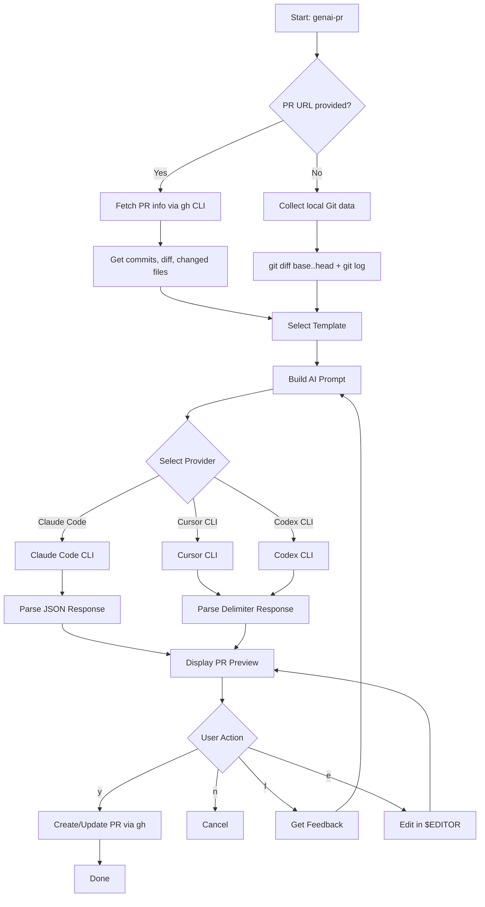

# genai-pr

AI-powered PR description generator using Claude Code, Cursor CLI, or Codex CLI.

[](https://www.npmjs.com/package/genai-pr)
[](https://opensource.org/licenses/MIT)
[](https://github.com/Seungwoo321/genai-pr)

## Features

- **AI-powered PR descriptions** - Generate PR title and body using Claude Code, Cursor CLI, or Codex CLI
- **Template-based** - Built-in templates (feature, bugfix) + custom project templates
- **Existing PR support** - Regenerate descriptions for existing PRs via `--url`
- **Multi-language support** - Generate titles and body in English or Korean
- **Interactive workflow** - Review, provide feedback, edit in editor, and refine before creating
- **GitHub CLI integration** - Creates PRs directly via `gh pr create`

## How It Works



## Prerequisites

You need at least one of these AI CLI tools installed:

- [Claude Code CLI](https://docs.anthropic.com/en/docs/claude-code) - Anthropic's official CLI (command: `claude`)
- [Cursor Agent CLI](https://www.cursor.com/) - Cursor's agent CLI (command: `agent`)
- [OpenAI Codex CLI](https://github.com/openai/codex) - OpenAI's Codex CLI (command: `codex`)

Additionally, the [GitHub CLI](https://cli.github.com/) (`gh`) must be installed and authenticated.

## Providers

Each provider can be referenced by its canonical name or short alias:

| Canonical | Short Alias | Underlying CLI |
|-----------|-------------|----------------|
| `claude-code` | `claude` | `claude` |
| `cursor-cli` | `cursor` | `agent` |
| `codex-cli` | `codex` | `codex` |

## Installation

```bash
# Global installation
npm install -g genai-pr

# Or use directly with npx (no installation required)
npx genai-pr claude
```

## Usage

### Generate PR Description

```bash
# Canonical names
genai-pr claude-code
genai-pr cursor-cli
genai-pr codex-cli

# Short aliases (equivalent)
genai-pr claude
genai-pr cursor
genai-pr codex

# One-liner with options
genai-pr claude -t feature -b main

# Specify head and base branches
genai-pr claude --branch feature/AUTH-123 --base develop

# Create as draft PR
genai-pr claude --draft

# Preview without creating PR
genai-pr claude --dry-run

# With specific model
genai-pr claude --model sonnet
genai-pr cursor --model claude-4.5-sonnet
genai-pr codex --model gpt-5.4
```

### Regenerate Existing PR Description

```bash
# Update an existing PR's title and body
genai-pr claude --url https://github.com/owner/repo/pull/15
```

### Authentication

```bash
# Login
genai-pr login claude
genai-pr login cursor
genai-pr login codex

# Check status
genai-pr status claude
genai-pr status cursor
genai-pr status codex
```

### List Supported Models

```bash
genai-pr models claude
genai-pr models cursor
genai-pr models codex
```

### List Available Templates

```bash
# List built-in and project templates
genai-pr templates

# Include custom template directory
genai-pr templates --template-dir ./my-templates
```

### Interactive Options

After generating the PR description, you'll see an interactive menu:

| Option | Description |
|--------|-------------|
| `[y]` | Create PR (or Update PR when using `--url`) |
| `[n]` | Cancel |
| `[f]` | Provide feedback to regenerate |
| `[e]` | Edit in external editor (`$EDITOR`) |

## Options

| Option | Description | Default |
|--------|-------------|---------|
| `-t, --template <name>` | PR template to use | interactive selection |
| `-b, --base <branch>` | Base/target branch | `main` |
| `--branch <branch>` | Head/source branch | current branch |
| `-m, --model <model>` | Model to use | `haiku` (Claude) / `claude-4.5-sonnet` (Cursor) / `gpt-5.4` (Codex) |
| `--lang <lang>` | Set both title and body language (en\|ko) | - |
| `--title-lang <lang>` | Language for PR title | `en` |
| `--body-lang <lang>` | Language for PR body | `ko` |
| `--template-dir <path>` | Custom template directory | - |
| `--draft` | Create as draft PR | `false` |
| `--dry-run` | Preview without creating PR | `false` |
| `--url <url>` | Existing PR URL to regenerate | - |

## Built-in Templates

### feature

```markdown
## Summary
## Changes
## Test Plan
```

### bugfix

```markdown
## Summary
## Root Cause
## Fix
## Test Plan
```

## Custom Templates

Templates are loaded with the following priority:

1. `--template-dir <path>` - Custom directory (highest priority)
2. `.github/PR_TEMPLATE/` - Project-level templates
3. Built-in templates (feature, bugfix)

Create a `.md` file in any of these locations. The filename (without extension) becomes the template name.

## Configuration

| Setting | Default | Description |
|---------|---------|-------------|
| `maxInputSize` | 50000 | Maximum AI input size in bytes |
| `maxDiffSize` | 30000 | Maximum diff size in bytes |
| `timeout` | 120000 | AI request timeout in ms |

## Requirements

- Node.js >= 18.0.0
- Git repository
- GitHub CLI (`gh`) installed and authenticated
- Claude Code CLI, Cursor CLI, or Codex CLI installed and authenticated

## License

MIT
